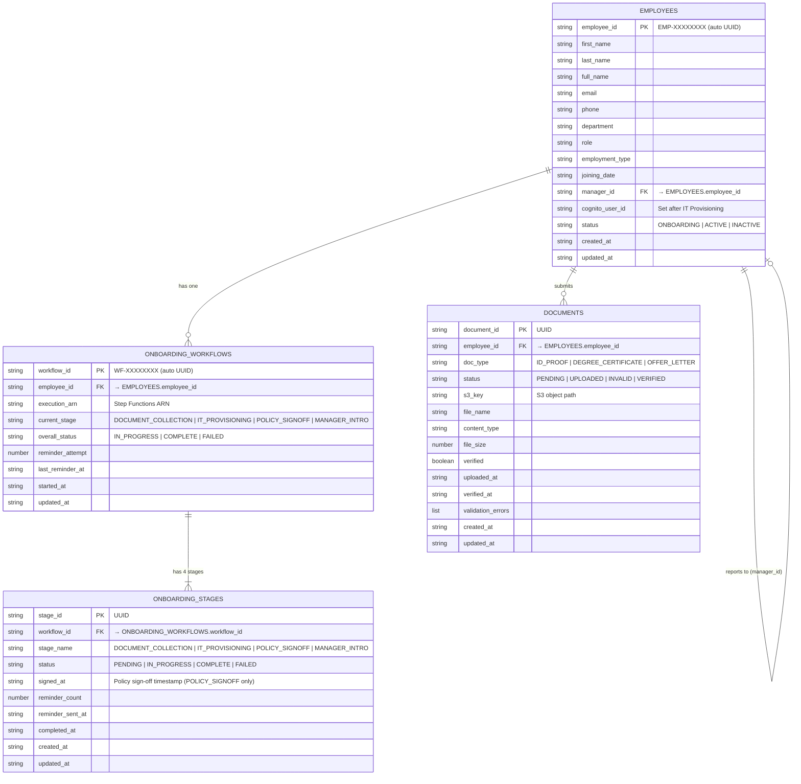

# ER Diagram — DynamoDB Employee Schema
## OnboardIQ HRMS · ap-south-1

---

## Mermaid Diagram (paste at mermaid.live to render)



---

## Table Details

### Table 1: `hrms-employees`
| Attribute | Type | Key | Notes |
|-----------|------|-----|-------|
| `employee_id` | String | **PK** | Auto-generated: `EMP-{UUID8}` |
| `first_name` | String | — | |
| `last_name` | String | — | |
| `full_name` | String | — | Concatenated on creation |
| `email` | String | — | Personal email (used for Cognito) |
| `phone` | String | — | |
| `department` | String | — | Engineering, Product, Design, etc. |
| `role` | String | — | Job title |
| `employment_type` | String | — | Full-time, Part-time, Contract, Intern |
| `joining_date` | String | — | ISO date `YYYY-MM-DD` |
| `manager_id` | String | — | FK → `hrms-employees.employee_id` |
| `cognito_user_id` | String | — | Set by IT Provisioning Lambda |
| `status` | String | — | ONBOARDING → ACTIVE on completion |
| `created_at` | String | — | ISO timestamp |
| `updated_at` | String | — | ISO timestamp |

**GSI:** None (scanned directly by workflow on creation)

---

### Table 2: `hrms-onboarding-workflows`
| Attribute | Type | Key | Notes |
|-----------|------|-----|-------|
| `workflow_id` | String | **PK** | Auto-generated: `WF-{UUID8}` |
| `employee_id` | String | **GSI PK** | `employee-index` GSI |
| `execution_arn` | String | — | Step Functions execution ARN |
| `current_stage` | String | — | Active stage name |
| `overall_status` | String | — | IN_PROGRESS → COMPLETE |
| `reminder_attempt` | Number | — | Incremented per reminder loop |
| `last_reminder_at` | String | — | ISO timestamp |
| `started_at` | String | — | ISO timestamp |
| `updated_at` | String | — | ISO timestamp |

**GSI:** `employee-index` → PK: `employee_id`

---

### Table 3: `hrms-onboarding-stages`
| Attribute | Type | Key | Notes |
|-----------|------|-----|-------|
| `stage_id` | String | **PK** | UUID |
| `workflow_id` | String | **GSI PK** | `workflow-index` GSI |
| `stage_name` | String | — | One of 4 stage names |
| `status` | String | — | PENDING → IN_PROGRESS → COMPLETE |
| `signed_at` | String | — | Set when employee signs policies |
| `reminder_count` | Number | — | |
| `reminder_sent_at` | String | — | |
| `completed_at` | String | — | ISO timestamp |
| `created_at` | String | — | ISO timestamp |
| `updated_at` | String | — | ISO timestamp |

**GSI:** `workflow-index` → PK: `workflow_id`  
**Note:** 4 stage records are created per workflow on employee creation.

---

### Table 4: `hrms-documents`
| Attribute | Type | Key | Notes |
|-----------|------|-----|-------|
| `document_id` | String | **PK** | UUID |
| `employee_id` | String | **GSI PK** | `employee-index` GSI |
| `doc_type` | String | — | ID_PROOF, DEGREE_CERTIFICATE, OFFER_LETTER |
| `status` | String | — | PENDING → UPLOADED → VERIFIED |
| `s3_key` | String | — | `documents/{employee_id}/{doc_type}/{document_id}-{filename}` |
| `file_name` | String | — | Original filename |
| `content_type` | String | — | application/pdf, image/jpeg, image/png |
| `verified` | Boolean | — | Set by HR after review |
| `validation_errors` | List | — | File type/size errors |
| `uploaded_at` | String | — | ISO timestamp |
| `verified_at` | String | — | ISO timestamp |
| `created_at` | String | — | ISO timestamp |
| `updated_at` | String | — | ISO timestamp |

**GSI:** `employee-index` → PK: `employee_id`  
**S3 Encryption:** Server-side encryption (AES-256) enabled on bucket.

---

## Relationships Summary

```
EMPLOYEES (1) ──────────────── (1) ONBOARDING_WORKFLOWS
                                          │
                                          │ (1)
                                          │
                                    ONBOARDING_STAGES (4 records per workflow)
                                    [DOCUMENT_COLLECTION]
                                    [IT_PROVISIONING]
                                    [POLICY_SIGNOFF]
                                    [MANAGER_INTRO]

EMPLOYEES (1) ──────────────── (3) DOCUMENTS
                                    [ID_PROOF]
                                    [DEGREE_CERTIFICATE]
                                    [OFFER_LETTER]

EMPLOYEES (N) ──────────────── (1) EMPLOYEES (self-join via manager_id)
```
