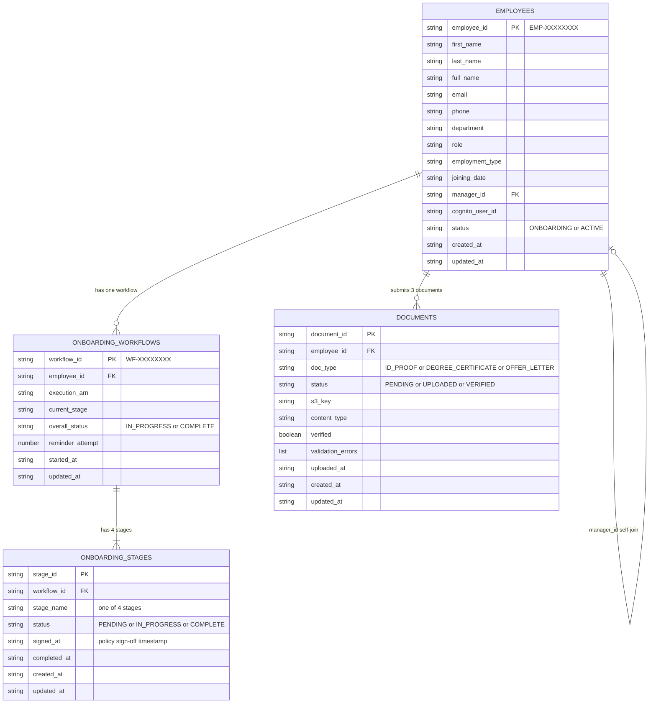

# OnboardIQ — Smart Employee Onboarding & Identity Service
### Internship Project · AWS Serverless · Full Stack
#### Team Presentation Document

---

> **What is this?**
> OnboardIQ is a fully automated, cloud-native employee onboarding platform. From the moment a new hire accepts their offer letter to their Day 1 login — everything is handled automatically. No manual emails. No spreadsheets. No chasing documents.

---

## Table of Contents

1. [The Problem We're Solving](#1-the-problem-were-solving)
2. [What OnboardIQ Does](#2-what-onboardiq-does)
3. [System Architecture](#3-system-architecture)
4. [AWS Services Used](#4-aws-services-used)
5. [Database Schema — ER Diagram](#5-database-schema--er-diagram)
6. [The Onboarding Workflow Engine](#6-the-onboarding-workflow-engine)
7. [Live Execution Proof](#7-live-execution-proof)
8. [Demo Walkthrough — Step by Step](#8-demo-walkthrough--step-by-step)
9. [Access the App](#9-access-the-app)

---

## 1. The Problem We're Solving

Traditional employee onboarding is broken:

| Old Way | OnboardIQ Way |
|---------|---------------|
| HR manually emails each new hire | Automated emails triggered by workflow |
| Documents collected over WhatsApp/email | Secure encrypted S3 upload portal |
| No visibility into who completed what | Real-time HR dashboard with stage tracking |
| IT provisions accounts days late | Cognito account created automatically on submission |
| Managers forget to greet new hires | Auto introduction email sent on joining date |
| No audit trail | Every action logged in DynamoDB with timestamps |

---

## 2. What OnboardIQ Does

OnboardIQ gives every new hire a **5-step self-service portal** and gives HR a **real-time dashboard** — all wired together by an automated AWS Step Functions workflow.

### The New Hire Does This:

```
Step 1 — Fill in your profile (name, department, role, joining date)
    ↓
Step 2 — Upload 3 documents (ID proof, degree, offer letter)
    ↓
Step 3 — Acknowledge 5 company policies (checkboxes)
    ↓
Step 4 — Meet your manager (optional note)
    ↓
Step 5 — Done! Check email for Day 1 credentials
```

### AWS Handles the Rest Automatically:

```
Employee submits form
    → DynamoDB record created
    → Step Functions workflow starts
    → Stage 1: Documents collected & validated in S3
    → Stage 2: Cognito account provisioned, credentials emailed
    → Stage 3: Policy sign-off recorded
    → Stage 4: Manager introduction email sent
    → Employee status updated to ACTIVE
    → HR dashboard reflects completion in real time
```

---

## 3. System Architecture

```
┌─────────────────────────────────────────────────────────────────┐
│                        FRONTEND (React/Vite)                     │
│              Hosted on S3 Static Website                         │
│  ┌─────────────────────┐    ┌──────────────────────────────┐    │
│  │   New Hire Portal   │    │     HR Admin Dashboard       │    │
│  │  (5-step wizard)    │    │  (real-time pipeline view)   │    │
│  └──────────┬──────────┘    └──────────────┬───────────────┘    │
└─────────────┼──────────────────────────────┼───────────────────┘
              │ API calls                     │ API calls
              ▼                              ▼
┌─────────────────────────────────────────────────────────────────┐
│                   API Gateway (REST API)                         │
│   POST /employees          GET  /employees                       │
│   POST /documents/upload-url   GET  /employees/{id}/progress     │
│   PUT  /employees/{id}/policy-signoff                            │
└────────────────────────┬────────────────────────────────────────┘
                         │ triggers
         ┌───────────────┼───────────────┐
         ▼               ▼               ▼
  ┌──────────────┐ ┌───────────┐ ┌──────────────┐
  │ CreateEmployee│ │ProgressAPI│ │DocumentUpload│
  │    Lambda    │ │  Lambda   │ │  URL Lambda  │
  └──────┬───────┘ └───────────┘ └──────────────┘
         │ starts
         ▼
┌─────────────────────────────────────────────────────────────────┐
│              AWS Step Functions State Machine                    │
│                  hrms-onboarding-workflow                        │
│                                                                  │
│  DocumentCollection → ITProvisioning → PolicySignoff → ManagerIntro │
│         │                  │               │               │    │
│         ▼                  ▼               ▼               ▼    │
│  [Lambda: stage-   [Lambda: stage- [Lambda: stage- [Lambda: stage-│
│   doc-collection]  it-provision]  policy-signoff] manager-intro] │
└──────────────────────────────────────────────────────────────────┘
         │
         ▼
┌──────────────────────────────────────────────────────────────────┐
│                       AWS Data Layer                             │
│                                                                  │
│  DynamoDB Tables:          S3 Bucket:          Cognito:          │
│  hrms-employees            hrms-onboarding-    User Pool for     │
│  hrms-onboarding-workflows documents-*         new hire accounts │
│  hrms-onboarding-stages    (encrypted)                           │
│  hrms-documents                                                  │
│                                                                  │
│  Notifications:                                                  │
│  SES → employee emails     SNS → HR team alerts                  │
└──────────────────────────────────────────────────────────────────┘
```

---

## 4. AWS Services Used

### Compute

| Service | What we use it for |
|---------|-------------------|
| **AWS Lambda** | 9 serverless functions — one per workflow stage, plus API handlers, document trigger, reminder sender |
| **AWS Step Functions** | Orchestrates the 4-stage onboarding pipeline; handles waits, retries, branching logic |

### Storage & Database

| Service | What we use it for |
|---------|-------------------|
| **Amazon DynamoDB** | 4 tables storing employee records, workflow state, stage status, and document metadata. NoSQL, millisecond reads |
| **Amazon S3** | Stores uploaded documents (ID proof, degree, offer letter) with AES-256 server-side encryption |

### Identity & Communication

| Service | What we use it for |
|---------|-------------------|
| **Amazon Cognito** | Automatically creates a user account for each new hire with a temporary password |
| **Amazon SES** | Sends transactional emails — welcome email, policy reminders, manager introductions |
| **Amazon SNS** | Sends HR team notifications when a new hire's documents are all received |

### API & Hosting

| Service | What we use it for |
|---------|-------------------|
| **Amazon API Gateway** | REST API that the frontend talks to — routes requests to the correct Lambda |
| **Amazon S3 (Static Website)** | Hosts the React frontend — no servers needed |

### Infrastructure as Code

| Service | What we use it for |
|---------|-------------------|
| **AWS SAM** | Defines the entire backend in a single `template.yaml` — deploys all Lambdas, tables, APIs, and permissions in one command |
| **AWS CloudFormation** | Provisions all resources behind SAM; tracks stack state |

### Lambda Functions — Full List

| Function Name | Trigger | Purpose |
|---------------|---------|---------|
| `hrms-create-employee` | API Gateway POST | Creates employee record + starts Step Functions |
| `hrms-progress-api` | API Gateway GET/PUT | Returns pipeline status; records policy sign-off |
| `hrms-document-upload-url` | API Gateway POST | Generates presigned S3 URLs for secure upload |
| `hrms-document-upload-trigger` | S3 Event | Fires on each upload; validates file; checks if all 3 received |
| `hrms-stage-document-collection` | Step Functions | Checks if all documents are uploaded in DynamoDB |
| `hrms-stage-it-provisioning` | Step Functions | Creates Cognito user; sends credentials via SES |
| `hrms-stage-policy-signoff` | Step Functions | Checks if employee signed all policies; sends reminder |
| `hrms-stage-manager-intro` | Step Functions | Sends introduction email to both employee and manager |
| `hrms-send-reminder` | Step Functions | Sends reminder emails when stages are incomplete |

---

## 5. Database Schema — ER Diagram

> Paste the diagram below at **https://mermaid.live** to view it rendered.



### Table Relationships Explained (Plain English)

- **1 Employee → 1 Workflow** — When a new hire submits their profile, a workflow record is created that tracks the big-picture status (In Progress / Complete).
- **1 Workflow → 4 Stages** — Each workflow has exactly 4 stage records pre-created: Document Collection, IT Provisioning, Policy Sign-off, Manager Intro. Each stage tracks its own status independently.
- **1 Employee → 3 Documents** — Each document upload creates a separate document record storing the S3 path, file type, validation result, and verification status.
- **Employee → Employee (self-join)** — The `manager_id` field points to another employee's `employee_id`, creating the org hierarchy within the same table.

---

## 6. The Onboarding Workflow Engine

The heart of OnboardIQ is an **AWS Step Functions state machine** that automatically drives every new hire through 4 stages. It's fully event-driven — no cron jobs, no polling.

### State Machine Flow Diagram

```
                    ┌─────────────────┐
                    │ ExecutionStarted │
                    └────────┬────────┘
                             │
                    ┌────────▼────────┐
                    │DocumentCollection│  ← Lambda checks DynamoDB for uploads
                    └────────┬────────┘
                             │
               ┌─────────────▼──────────────┐
               │    CheckDocumentsComplete?  │
               └────┬──────────────────┬────┘
                  YES                  NO
                    │         ┌────────▼────────────┐
                    │         │ CheckReminderLimit  │ (max 3 reminders)
                    │         └────────┬────────────┘
                    │              < 3 │         ≥ 3
                    │         ┌────────▼──┐   ┌────────▼──────┐
                    │         │  Send     │   │ DocumentsOverdue│
                    │         │ Reminder  │   │  → FAILED      │
                    │         └─────┬─────┘   └───────────────┘
                    │               │
                    │         ┌─────▼──────────┐
                    │         │ WaitForDocuments│ (30s demo / 24h prod)
                    │         └─────┬──────────┘
                    │               │ loops back to DocumentCollection
                    │
           ┌────────▼────────┐
           │  ITProvisioning  │  ← Creates Cognito account, sends credentials
           └────────┬────────┘
                    │
          ┌─────────▼───────────┐
          │   CheckITComplete?  │
          └────┬────────────────┘
             YES
               │
      ┌────────▼────────┐
      │  PolicySignoff   │  ← Checks DynamoDB for signed_at timestamp
      └────────┬────────┘
               │
      ┌────────▼──────────────┐
      │  WaitForPolicySignoff  │ (30s demo / 24h prod)
      └────────┬──────────────┘
               │
      ┌────────▼────────┐
      │  ReCheckPolicies │  ← Reads signed_at from DynamoDB
      └────────┬────────┘
               │
     ┌──────────▼──────────┐
     │  CheckPolicyComplete?│
     └────┬────────────────┘
         YES
           │
  ┌────────▼────────┐
  │   ManagerIntro   │  ← Sends intro emails to employee + manager
  └────────┬────────┘
           │
  ┌────────▼──────────┐
  │  OnboardingComplete│  ✅ SUCCEED
  └───────────────────┘
```

### Why Step Functions?

Without Step Functions, you'd need a server running 24/7 checking "has the employee uploaded their documents yet?" With Step Functions:
- The workflow **pauses** itself during wait states — no compute cost
- Each stage is **retried automatically** if it fails
- The entire execution history is **auditable** in the AWS console
- Adding a new stage means adding one block to the JSON definition

---

## 7. Live Execution Proof

**Execution ID:** `onboarding-EMP-4FEA92A3-1775641312919`  
**Employee:** Arjun Sharma — Product Manager  
**Result:** ✅ SUCCEEDED  
**Total Time:** 66 seconds (all 4 stages)

> **Note for presentation:** Open the AWS console → Step Functions → `hrms-onboarding-workflow` → Executions tab to show the green visual graph live.
> Console URL: `https://ap-south-1.console.aws.amazon.com/states/home?region=ap-south-1#/statemachines`

### Execution Event Log (Real Data from AWS)

```
TIME (IST)      EVENT                          STATE
─────────────────────────────────────────────────────────────────────
15:11:53.054  → ENTER    DocumentCollection        [Stage 1 starts]
15:11:54.394  ← EXIT     DocumentCollection        [Docs not yet received]
15:11:54.394  → ENTER    CheckDocumentsComplete    [Decision: incomplete]
15:11:54.394  → ENTER    CheckDocumentReminderLimit [Attempt 0 < 3, OK]
15:11:54.394  → ENTER    SendDocumentReminder      [Reminder email queued]
15:11:54.677  ← EXIT     SendDocumentReminder
15:11:54.677  → ENTER    IncrementReminderAttempt  [Counter: 0 → 1]
15:11:54.677  → ENTER    WaitForDocuments          [⏳ 30-second wait]
              .
              . (documents uploaded during this wait)
              .
15:12:24.724  ← EXIT     WaitForDocuments          [Wait complete]
15:12:24.724  → ENTER    ReCheckDocuments          [Re-run Lambda]
15:12:25.234  ← EXIT     ReCheckDocuments          [All 3 docs received ✓]
15:12:25.234  → ENTER    CheckDocumentsComplete    [Decision: COMPLETE]

15:12:25.234  → ENTER    ITProvisioning            [Stage 2 starts]
15:12:26.938  ← EXIT     ITProvisioning            [Cognito user created ✓]
15:12:26.938  → ENTER    CheckITComplete           [Decision: COMPLETE]

15:12:26.938  → ENTER    PolicySignoff             [Stage 3 starts]
15:12:27.239  ← EXIT     PolicySignoff             [signed_at found in DB ✓]
15:12:27.239  → ENTER    WaitForPolicySignoff      [⏳ 30-second wait]
              .
              .
15:12:57.281  ← EXIT     WaitForPolicySignoff
15:12:57.281  → ENTER    ReCheckPolicies           [Re-run Lambda]
15:12:57.510  ← EXIT     ReCheckPolicies           [allPoliciesSigned = true ✓]
15:12:57.510  → ENTER    CheckPolicyComplete       [Decision: COMPLETE]

15:12:57.510  → ENTER    ManagerIntro              [Stage 4 starts]
15:12:59.609  ← EXIT     ManagerIntro              [Emails sent ✓]
15:12:59.609  → ENTER    OnboardingComplete        [✅ SUCCESS]
15:12:59.627    EXECUTION SUCCEEDED
─────────────────────────────────────────────────────────────────────
```

### Stage Completion Summary

| Stage | Lambda Invoked | Duration | Result |
|-------|---------------|----------|--------|
| Document Collection | `hrms-stage-document-collection` | ~32s | ✅ All 3 docs received |
| IT Provisioning | `hrms-stage-it-provisioning` | ~1.7s | ✅ Cognito user created |
| Policy Sign-off | `hrms-stage-policy-signoff` | ~30.3s | ✅ All 5 policies signed |
| Manager Intro | `hrms-stage-manager-intro` | ~2.1s | ✅ Intro emails sent |
| **TOTAL** | | **~66 seconds** | **✅ COMPLETE** |

---

## 8. Demo Walkthrough — Step by Step

> **This section is for anyone running the demo.** Follow it exactly and you will simulate a complete new hire onboarding from start to finish.

### Before You Start

You need two browser tabs open:
- **Tab 1 — App:** http://hrms-onboarding-frontend-dev.s3-website.ap-south-1.amazonaws.com
- **Tab 2 — AWS Console (optional):** https://ap-south-1.console.aws.amazon.com/states/home?region=ap-south-1#/statemachines

---

### PART A — New Hire Experience

#### Step A1 — Open the App

1. Go to the app URL in Tab 1
2. Wait for the **splash screen** to animate (OnboardIQ logo appears, 3 dots pulse)
3. The **landing page** appears with two big cards
4. Point out: *"Left card = new hire portal. Right card = HR admin view."*

---

#### Step A2 — Enter the New Hire Portal

1. Click **"New Hire Portal"** (the card with the stack icon)
2. A new splash screen plays with subtitle "New Hire Portal"
3. You land on **Step 1 of 4: Your Profile**

---

#### Step A3 — Fill In Your Profile

Fill in the form with these details (or any name you like):

| Field | Value to Enter |
|-------|---------------|
| First Name | `Priya` |
| Last Name | `Menon` |
| Personal Email | `priya.menon@example.com` |
| Phone Number | `+91 98765 43210` |
| Date of Joining | *(today's date)* |
| Department | `Engineering` |
| Role / Title | `Frontend Engineer` |
| Employment Type | `Full-time` |

5. Click **Continue →**
6. You will see a brief loading spinner — this is the Lambda creating the employee record in DynamoDB and starting the Step Functions workflow
7. ✅ You advance to Step 2

> **What just happened behind the scenes:**
> - A new `employee_id` like `EMP-A1B2C3D4` was created in DynamoDB
> - A workflow record `WF-XXXXXXXX` was created
> - 4 stage records (PENDING) were created
> - 3 document slots (PENDING) were created
> - AWS Step Functions execution started

---

#### Step A4 — Upload Documents

You are now on **Step 2: Documents**

You need to upload 3 files. Use any 3 PDF files on your computer — they don't need to be real documents for demo purposes.

1. Click the **"Government ID Proof"** card → choose any PDF → a green "Uploaded" badge appears
2. Click the **"Degree Certificate"** card → choose any PDF → "Uploaded" badge
3. Click the **"Signed Offer Letter"** card → choose any PDF → "Uploaded" badge
4. All 3 cards now show green badges
5. Click **Continue →**

> **What just happened behind the scenes:**
> - Each file was uploaded directly to S3 using a secure presigned URL (no file passes through the server)
> - S3 fired an event trigger for each upload
> - A Lambda function validated each file (type + size)
> - Once all 3 were received, the Document Collection stage was marked **COMPLETE** in DynamoDB
> - HR received an SNS + SES notification

---

#### Step A5 — Acknowledge Policies

You are now on **Step 3: Policy Sign-off**

1. Read through the 5 policy names listed
2. Click each checkbox one by one — watch the **progress bar** fill up at the bottom
3. Once all 5 are checked, the bar is full
4. Click **Continue →**

> **What just happened:**
> - A `PUT /employees/{id}/policy-signoff` API call was made
> - DynamoDB was updated with `signed_at` timestamp on the Policy Sign-off stage
> - Step Functions will check this timestamp on its next cycle and advance

---

#### Step A6 — Manager Introduction

You are now on **Step 4: Manager Intro**

1. Read the manager card — *"Will be assigned based on your department"*
2. Optionally type a question: `"What does the first week look like?"`
3. Click **Submit & Complete ✓**

> **What just happened:**
> - The manager intro Lambda will fire and send introduction emails to both the new hire and their manager
> - The new hire's Cognito account credentials will be in their email

---

#### Step A7 — Completion Screen

You now see the **"You're all set!"** screen with:
- ✓ Done — Employee record created
- ✓ Done — Onboarding workflow started
- ↻ In progress — Documents submitted for HR review
- ↻ In progress — IT provisioning & credentials
- ○ Pending — Manager introduction email

5. Click **← Back to Home**

---

### PART B — HR Admin Dashboard

#### Step B1 — Open HR Dashboard

1. From the landing page, click **"HR Admin Dashboard"** (the card with the chart icon)
2. A splash screen plays
3. The **PIN gate** appears

#### Step B2 — Enter the PIN

1. Type `1234` — digit by digit
2. Watch: as soon as the 4th digit is typed, the PIN screen **fades out automatically** (no Enter needed)
3. The dashboard **fades in** smoothly

> *The PIN gate appears every time you navigate away and return — it is not saved in the browser.*

---

#### Step B3 — Read the Stats Bar

At the top you'll see 5 metric cards:

| Card | What it means |
|------|--------------|
| **Total Employees** | Everyone ever onboarded |
| **In Progress** | Actively going through onboarding |
| **Completed** | Fully onboarded, account active |
| **Documents Pending** | Hires who haven't uploaded all 3 docs |
| **Avg Completion %** | Average progress across all active pipelines |

---

#### Step B4 — Find Your New Hire

1. Use the **search bar** to type `Priya` — the table filters live
2. You'll see Priya Menon's row with:
   - Her department and role
   - Joining date
   - A mini progress bar showing completed stages
   - Document status

---

#### Step B5 — Expand the Detail Panel

1. Click anywhere on Priya's row
2. A panel slides open below showing two columns:

**Left column — Onboarding Stages:**
- Document Collection — Done (with timestamp)
- IT Provisioning — Done (with timestamp)
- Policy Sign-off — Done (with timestamp)
- Manager Intro — Done (with timestamp)

**Right column — Documents & Actions:**
- ID_PROOF — Uploaded
- DEGREE_CERTIFICATE — Uploaded
- OFFER_LETTER — Uploaded
- Action buttons: View Profile, Send Reminder, Download Docs

---

#### Step B6 — Refresh the Dashboard

1. Click the **Refresh** button (top right, next to the bell icon)
2. The button shows a spinning icon and says "Refreshing..."
3. Data reloads from the live API
4. Button returns to normal

---

#### Step B7 — Filter by Status

1. Try clicking the filter pills above the table: **All · In Progress · Completed · Pending**
2. Each pill filters the table to that status category

---

### PART C — Verify in AWS Console (Optional — for evaluation)

#### Step C1 — Step Functions

1. Open https://ap-south-1.console.aws.amazon.com/states/home?region=ap-south-1#/statemachines
2. Click **hrms-onboarding-workflow**
3. Click the **Executions** tab
4. Find the latest SUCCEEDED execution
5. Click it — you'll see the visual graph with all states highlighted green
6. Click the **Events** tab for the full timeline

#### Step C2 — DynamoDB

1. Open https://ap-south-1.console.aws.amazon.com/dynamodbv2/home?region=ap-south-1#tables
2. Click **hrms-employees** → **Explore table items**
3. Find Priya Menon — show `status: ACTIVE`, `cognito_user_id` populated
4. Click **hrms-onboarding-stages** → all 4 stages show `status: COMPLETE`

#### Step C3 — S3

1. Open https://s3.console.aws.amazon.com/s3/buckets/hrms-onboarding-documents-736786104206-dev
2. Browse to `documents/{employee_id}/` — see the 3 uploaded files
3. Show the bucket has **Server-side encryption** enabled (Properties tab)

---

## 9. Access the App

| Resource | URL / Value |
|----------|-------------|
| **Live App** | http://hrms-onboarding-frontend-dev.s3-website.ap-south-1.amazonaws.com |
| **New Hire Portal** | *(app)* → New Hire Portal |
| **HR Dashboard** | *(app)* → HR Admin Dashboard |
| **HR PIN** | `1234` |
| **API Base URL** | https://clqevbuml1.execute-api.ap-south-1.amazonaws.com/dev |
| **AWS Region** | ap-south-1 (Mumbai) |
| **Stack Name** | `hrms-onboarding-stack` |
| **Step Functions** | hrms-onboarding-workflow |

---

## Tech Stack Summary

```
Frontend:    React 18 + Vite · React Router · CSS Modules · Lucide Icons
Backend:     Node.js 20 · AWS Lambda (ARM64) · AWS SAM
Database:    Amazon DynamoDB (4 tables, 3 GSIs)
Storage:     Amazon S3 (AES-256 encrypted)
Workflow:    AWS Step Functions (Express → Standard state machine)
Auth:        Amazon Cognito User Pool
Email:       Amazon SES (transactional)
Alerts:      Amazon SNS (HR notifications)
API:         Amazon API Gateway (REST)
Hosting:     Amazon S3 Static Website
IaC:         AWS SAM + CloudFormation
Region:      ap-south-1 (Mumbai)
```

---

*Built as an internship project · OnboardIQ HRMS · 2026*
