# OnboardIQ — Architecture Diagram

Render with any Mermaid-compatible viewer (GitHub, VS Code Mermaid extension, mermaid.live).

```mermaid
graph TD
    subgraph Frontend["Frontend (S3 Static / Vite)"]
        LP[LandingPage]
        NHP[NewHirePortal]
        HRD[HRDashboard]
    end

    subgraph APIGW["API Gateway REST (hrms-onboarding-api)"]
        EP1["POST /employees\n(no auth)"]
        EP2["GET /employees/{id}/progress\n(no auth)"]
        EP3["POST /employees/{id}/documents/upload-url\n(no auth)"]
        EP4["PUT /employees/{id}/policy-signoff\n(no auth)"]
    end

    subgraph Cognito["Cognito User Pool (hrms-employee-pool)"]
        CUP[CognitoAuthorizer]
    end

    subgraph Lambdas["Lambda Functions"]
        CE["hrms-create-employee\nIAM: DDB CRUD + Cognito AdminCreate\n+ states:StartExecution + SES identity/*"]
        PA["hrms-progress-api\nIAM: DDB Read + Scan"]
        DUU["hrms-document-upload-url\nIAM: S3 Write + DDB CRUD"]
        DUT["hrms-document-upload-trigger\nIAM: S3 Read + DDB CRUD + SNS Publish + SES identity/*"]
        SNS_SETUP["hrms-s3-notification-setup\nIAM: s3:PutBucketNotification"]
        ALARM_SIM["hrms-alarm-simulation\n(demo only — always throws)"]
    end

    subgraph StepFunctions["Step Functions State Machine (hrms-onboarding-workflow)"]
        SF_ROLE["StepFunctions IAM Role\nlambda:InvokeFunction on 5 ARNs"]
        DC["hrms-stage-document-collection\nIAM: DDB CRUD StageTable+DocTable + SES identity/*"]
        IT["hrms-stage-it-provisioning\nIAM: DDB CRUD + Cognito Admin* + SES identity/*"]
        PS["hrms-stage-policy-signoff\nIAM: DDB CRUD StageTable + SES identity/*"]
        MI["hrms-stage-manager-intro\nIAM: DDB CRUD 3 tables + SES identity/*"]
        RM["hrms-send-reminder\nIAM: DDB CRUD StageTable+WorkflowTable + SES identity/*"]
    end

    subgraph Storage["Storage"]
        DDB1[(hrms-employees\nSSE + PITR)]
        DDB2[(hrms-onboarding-workflows\nSSE)]
        DDB3[(hrms-onboarding-stages\nSSE)]
        DDB4[(hrms-documents\nSSE)]
        S3["hrms-onboarding-documents-*\nEncrypted + Versioned\nPublic Access Blocked"]
    end

    subgraph Notifications["Notifications"]
        SES["AWS SES\nTransactional email"]
        SNS_TOPIC["SNS: hrms-hr-notifications\nEmail → HR + CloudWatch Alarms"]
    end

    subgraph Observability["Observability"]
        XRAY["X-Ray Active Tracing\n(all Lambdas)"]
        CWL["CloudWatch Logs\n(all Lambda log groups)"]
        CWA["CloudWatch Alarms\n12 alarms: error-rate + duration\nper function → SNS"]
        CWD["CloudWatch Dashboard\nhrms-onboarding-observability\nInvocations + Errors + Duration + Alarms"]
        LI["Log Insights Query\nStage failure heatmap"]
    end

    LP -->|POST /employees| EP1
    NHP -->|GET progress, POST upload-url, PUT policy| EP2
    NHP --> EP3
    NHP --> EP4
    HRD -->|GET /employees| EP2

    EP1 --> CE
    EP2 --> PA
    EP3 --> DUU
    EP4 --> PA

    CE --> DDB1
    CE --> DDB2
    CE --> DDB3
    CE -->|AdminCreateUser| Cognito
    CE -->|StartExecution| StepFunctions

    PA --> DDB1
    PA --> DDB2
    PA --> DDB3
    PA --> DDB4

    DUU --> S3
    DUU --> DDB4

    S3 -->|S3 Event| DUT
    DUT --> DDB4
    DUT --> DDB3
    DUT --> SNS_TOPIC

    SF_ROLE --> DC
    SF_ROLE --> IT
    SF_ROLE --> PS
    SF_ROLE --> MI
    SF_ROLE --> RM

    DC --> DDB3
    DC --> DDB4
    DC --> SES

    IT --> DDB3
    IT --> DDB1
    IT --> Cognito
    IT --> SES

    PS --> DDB3
    PS --> SES

    MI --> DDB3
    MI --> DDB1
    MI --> DDB2
    MI --> SES

    RM --> DDB3
    RM --> DDB2
    RM --> SES

    SNS_SETUP -->|PutBucketNotification| S3

    CE -.->|traces| XRAY
    PA -.->|traces| XRAY
    DUU -.->|traces| XRAY
    DUT -.->|traces| XRAY
    DC -.->|traces| XRAY
    IT -.->|traces| XRAY
    PS -.->|traces| XRAY
    MI -.->|traces| XRAY
    RM -.->|traces| XRAY
    ALARM_SIM -.->|traces| XRAY

    CWA -->|ALARM state| SNS_TOPIC
    SNS_TOPIC -->|email| HRD
```

## IAM Role Summary

| Lambda | Role Permissions (key) |
|--------|----------------------|
| hrms-create-employee | DDB CRUD (3 tables), Cognito AdminCreate+SetPassword, states:StartExecution, SES identity/*, xray:Put* |
| hrms-progress-api | DDB Read + Scan (4 tables), xray:Put* |
| hrms-document-upload-url | S3 Write, DDB CRUD (documents), xray:Put* |
| hrms-document-upload-trigger | S3 Read, DDB CRUD (2 tables) + Read (2 tables), sns:Publish, SES identity/*, xray:Put* |
| hrms-stage-document-collection | DDB CRUD (stages + documents), SES identity/*, xray:Put* |
| hrms-stage-it-provisioning | DDB CRUD (stages + employees), Cognito Admin*, SES identity/*, xray:Put* |
| hrms-stage-policy-signoff | DDB CRUD (stages), SES identity/*, xray:Put* |
| hrms-stage-manager-intro | DDB CRUD (stages + employees + workflows), SES identity/*, xray:Put* |
| hrms-send-reminder | DDB CRUD (stages + workflows), SES identity/*, xray:Put* |
| hrms-s3-notification-setup | s3:PutBucketNotification |
| hrms-alarm-simulation | xray:Put* only |
| StepFunctions Role | lambda:InvokeFunction on 5 specific ARNs |
